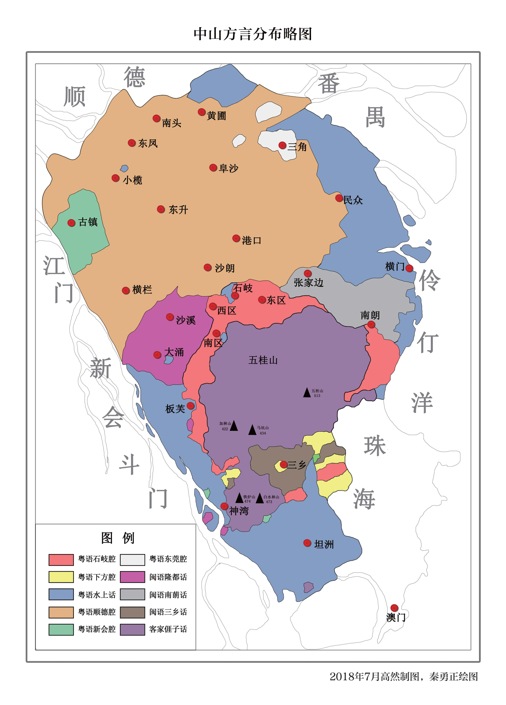

# 菊韻

Shield: [![CC BY-NC-SA 4.0][cc-by-nc-sa-shield]][cc-by-nc-sa]

This work is licensed under a
[Creative Commons Attribution-NonCommercial-ShareAlike 4.0 International License][cc-by-nc-sa].

[![CC BY-NC-SA 4.0][cc-by-nc-sa-image]][cc-by-nc-sa]

[cc-by-nc-sa]: http://creativecommons.org/licenses/by-nc-sa/4.0/
[cc-by-nc-sa-image]: https://licensebuttons.net/l/by-nc-sa/4.0/88x31.png
[cc-by-nc-sa-shield]: https://img.shields.io/badge/License-CC%20BY--NC--SA%204.0-lightgrey.svg

`gukwan.temp.dict.yaml`爲`jyut6ping3.words.dict.yaml`無輸入碼版本，`gukwan.lettered.dict.yaml`基於`jyut6ping3.lettered.dict.yaml`。作者爲「粵語計算語言學基礎建設組」([@CanCLID](https://github.com/CanCLID)) ，證書跟隨源文件爲[CC BY 4.0](https://creativecommons.org/licenses/by/4.0/)。

**測試階段：預計4月完成**

## 簡介

此爲[RIME | 中州韻輸入法引擎](https://rime.im/)方案，用於輸入小欖話爲主既粵語方言，拼音基於分韻廣韻以兼容各地方音(如師syu1 si1兩音)。爲兼容性同方便整理，輸入碼同實際拼音有所不同，但可直接以粵拼輸入。

現有字庫根據excel大批量轉換，有不少紕漏，敬請見諒。廣韻之外字庫未完成，目前缺少現代字同粵字，缺少部份白讀音。（7.0更新：多數現代字粵字已完成）

菊韻無法兼顧所有粵語方言，亦竝非本方案之目的。本方案並非廣州話方案，廣州話（穗港澳）請用[rime/rime-cantonese: Rime Cantonese input schema | 粵語拼音輸入方案](https://github.com/rime/rime-cantonese)

### 方言

雖然好多人講到中山話，多會諗到石歧話，之但是分佈最廣泛其實係所謂沙田方言，人口最爲之多，以中山北部爲主，方音近似順德（尤其北部），故出到去唔少人聞到都以爲係順德話。

|  |  |
| ---------------------------- | --------------------------------------------------- |
| 圖一：中山方言地圖           | 圖二：中山方言分佈畧圖                              |

圖一爲本人根據《[中山市誌（2005年版）](http://www.zsdag.cn/list?t_id=96)》所作之粗畧版方言地圖，粵語分爲五類：橙色爲沙田話（近順德話）、紅色爲三角話（近東莞話）、紫色爲古鎮話（近新會話）、紅色爲石歧話、金色則爲中山域外之順德話。綠色爲中山閩語，藍色爲客家話。顏色代表區域主要方言。（板芙鎮：粵語（沙田話）爲主，亦有少數客閩兩語分佈。南蓢鎮：閩語（南蓢話）爲主 ；三鄉鎮：閩語（三鄉話）爲主，亦有少數客粵兩語分佈；坦洲鎮：粵（沙田話）客兩語；神灣鎮：粵（沙田話）客兩語。張家邊鎮（東鄉）：即火炬區，除東莞話皆有。）

加筆：所謂沙田話，多爲文件資料上既講法，實際上無幾個人眞係聽過呢個講法。不過沙田話亦都係貼切既，因爲渠分佈既地方以前基本上眞係田基，呢幾十年工業發展先填起來既，

圖二摘自高然於2019年出版《中山方言誌》，將粵語分爲六類，並無將小欖話（同其周邊方言）、蜑家話等混爲一談。資料較中山市誌詳細許多。

加筆：三角鎮白色並非水域，而係三角話。

## 文件結構

### 方案

- `gukwan.schema.yaml`：調試用・自用
- 古代音
  - `gukwan-default.schema.yaml`：構擬音
    - 根據菊韻標準所構擬之古音
  - `gukwan-fanwan.schema.yaml`：分韻音
    - 準確來講此方案係分韻風，並不能準確反映所有分韻發音。若欲使用完全分韻音打字，可參攷以下方案：[leimaau/old-Cantonese: Rime Old Cantonese Input Scheme | 《分韻撮要》音系及輸入方案](https://github.com/leimaau/old-Cantonese)
- 現代音
  - `gukwan-fanwan.schema.yaml`：廣州音
    - 準確來講此方案係廣州風，並不能準確反映所有廣州發音。若欲使用完全廣州音打字，可參攷以下方案：[rime/rime-cantonese: Rime Cantonese input schema | 粵語拼音輸入方案](https://github.com/rime/rime-cantonese)

### 字詞

`gukwan.dict.yaml`用於調用字庫詞庫，默認亦調用rime-cantonese部份詞庫。

- 字庫
  - `gukwan.basic.dict.yaml`：廣韻字庫
  - `gukwan.one.dict.yaml`：增廣一組廣韻異音訓讀增補
  - `gukwan.two.dict.yaml`：增廣二組今字異字異音訓讀增補
- 詞庫
  - `gukwan.temp.dict.yaml`：`jyut6ping3.words.dict.yaml`無輸入碼版本
  - `gukwan.lettered.dict.yaml`：基於`jyut6ping3.lettered.dict.yaml`

## 安裝

1. 安裝RIME（WINDOWS：[小狼毫](https://github.com/rime/weasel)；MacOS：[鼠鬚管](https://github.com/rime/squirrel)；Linux：[Fcitx5](https://github.com/fcitx/fcitx5)、[Fcitx5-Rime](https://github.com/fcitx/fcitx5-rime)；Android：[同文輸入法](https://github.com/osfans/trime)｜[Fcitx5-Android](https://github.com/fcitx5-android/fcitx5-android)、[Fcitx5-Android-Rime](https://github.com/fcitx5-android/fcitx5-android/blob/master/plugin/rime)）
2. 安裝以下倉庫
   1. [rime-cantonese](https://github.com/rime/rime-cantonese)（必選，用於反查廣州話、八股文、部份詞庫）
   2. [rime-kanas](https://github.com/HoengSaan/rime-kanas)（可選，用於輸入假名）
   3. [rime-cantonese-emoji](https://github.com/rime/rime-emoji-cantonese)（可選，用於輸入Emoji）
   4. **rime-gukwan**（本方案）

用家可參攷以下文章：

- [Home · rime/rime-cantonese Wiki](https://github.com/rime/rime-cantonese/wiki)（多平臺）
- [Android 上的 RIME 输入法 trime 同文输入法使用 | Verne in GitHub](https://blog.einverne.info/post/2021/04/use-trime-input-method-rime-on-android.html#安装和基础使用)（Android：同文）

Android亦可選擇小企鵝（fcitx5），但安裝對一般用家來講較爲困難，亦無簡單易明既教程故此簡畧介紹（前提有Windows或其他電腦輔助）。

1. 在電腦安裝RIME並配置好。
2. Download APP同RIME插件即可。手機通常使用arm64-v8a。（Google Play版本更新速度慢，建議從Github [Releases · fcitx5-android/fcitx5-android](https://github.com/fcitx5-android/fcitx5-android/releases) Download）
3. 安裝，須開啓「允許此來源的應用程序」。
4. 於Fcitx5→Addons啓用Rime插件
5. 將電腦端RIME目錄文件（Windows默認：C:\Program Files (x86)\Rime\weasel-0.xx.x\data），壓縮竝送至Android設備，建議使用zip等主流格式即可。
6. 於Android設備解壓文件並送至`/Android/data/org.fcitx.fcitx5.android/files/data/rime/`。
   1. 普通用家須從Fcitx5進入。Fcitx5→Addons→Rime設定（齒輪符號）→User data dir→OK即可移動，左邊即有選單。將解壓後既文件全數Copy，然後送至上述地址（左邊選單→Fcitx5 for Android→rime）。
   1. Root用家直接連接電腦即可傳送文件，毋須經過以上麻煩步驟。
7. 配置文件：開啓Fcitx5鍵盤竝切換至Rime輸入法，用左上角「>」符號開工具列，再撳「…」開輸入法設定，最後撳Reload Config等待輸入法配置完成。 

## 輸入

### 鍵位


### 拼音表

拼音方案基於擴展粵拼，現代音（今音）同粵拼無區別，直接使用即可。

同今時大多數粵拼輸入法一樣，可以輸入聲調以加快蒐字速度。

|      | 平         | 上     | 去     | 上入  | 下入     |
| ---- | ---------- | ------ | ------ | ----- | -------- |
| 陰   | 1 (55/53)  | 2 (24) | 3 (33) | 1 (5) | 3 (3)    |
|      | 詩         | 矢     | 試     | 適    | 惜(白讀) |
| 鍵位 | v          | x      | q      | v     | q        |
| 陽   | 4 (42/55*) | 5 (13) | 6 (21) | 6 (2) | 2* (35)  |
|      | 時         | 市     | 示     | 食    | 食(過去) |
| 鍵位 | vv         | xx     | qq     | v     | q        |

調值僅供參攷，部份方言僅有9個或8個聲調。2*並非廣州話「新入」只見於入聲字變調，如「子」白讀zaai2*就同本身陰上調值（24）不一。此調亦用作表達過去、完成之文法意味。

註：師韻默認爲y，擴展粵拼標準爲ii，須手動開啓轉換式。（現代音可無視）

### 反查

目前方案預設四個反查：

- 粵拼（[rime-cantonese](https://github.com/rime/rime-cantonese)），粵語廣州話反查。鍵值爲<code>`</code>
- 明月拼音（rime-luna_pinyin），北語普通話反查。鍵值爲`X`。
- 倉頡五代（rime-cangjie5），倉頡反查。鍵值爲`V`。
- 假名（[rime-kanas](https://github.com/HoengSaan/rime-kanas)），以細階輸入平假名，大階輸入片假名。鍵值爲`R`。

**粵拼同假名須安裝方可使用反查**，安裝方法見上方安裝段。如需使用其他方案反查，請自行搜索竝改變方案。

## 定製

**※請閣下務必閱讀說明（即本頁）同方案文件（即以schema.yaml結尾之文件）方進行方案定製※**

**※定製任何方案務必進行版本備份竝進行測試，以免發生意外※**

方案無法兼顧所有粵語方言，亦竝非本方案之目的。定製本方案需要對音韻學同粵語音韻有基本理解方可進行。

方案本身預設有約百條轉換規則，有簡介其轉換之音位。刪除行頭井號啓用轉換，行頭鍵入井號停止轉換。（即行頭有井號爲停止轉換，行頭無井號爲啓用轉換）若表內無適合規則請自行增添，方法請參攷[SpellingAlgebra · rime/home Wiki](https://github.com/rime/home/wiki/SpellingAlgebra)。

注意schema_id必須同其他方案不同，否則無法使用。translator下方必須使用prism同基底字庫詞庫進行隔離。以下以`gukwan-fanwan.schema.yaml`作例。

```yaml
__include: gukwan.schema:/	# 用於調用基底文件

schema:
  schema_id: gukwan-fanwan	# 用於區別基底文件「gukwan」
  name: 菊韻分韻音	# 用於區別基底文件「菊韻」

###===###

speller:
  alphabet: zyxwvutsrqponmlkjihgfedcba
  delimiter: " '"
  algebra:
  # 此部份用於定製，建議以gukwan.schema.yaml爲藍本參攷範例自行調整，表內無敬請自行增添，部分字或要用個人字庫。

translator:
  dictionary: gukwan
  prism: gukwan-fanwan	# 用於區別基底文件「gukwan」
  
###===###
```

### 聲母定製

本方案聲母極其簡單，同分韻竝無大區別，現代音請直接將此部份所有轉換式全數啓用。其他請根據自己口音調整。

```yaml
    #聲母——現代
    #- derive/^(z|c|s)h/$1/                 # 精照合流(zh->z)
    #- derive/^(zj|cj|sj)yo(?=\d)/$1yu/     # 精照合流
    #- derive/^(z|c|s)j(?!yo)/$1/           # 精照合流(ch->c)
    #- derive/^(z|c)r/$1/                   # 精照合流(sj->s)
    #- derive/^nj/j/                        # 日以合流(nj->j)
```

### 韻母定製

7.1更新：最新版已有多數方音轉換式，識粵拼即可自行定製，毋須音韻學智識。建議參攷特徵表同[韻母表](https://github.com/HoengSaan/rime-gukwan/blob/main/pic/wanmaubiu.png)。（未完成）

## 特徵表

關於韻母區別對比詳細見[韻母表](https://github.com/HoengSaan/rime-gukwan/blob/main/pic/wanmaubiu.png)。


1. 現代音聲調爲十個，由於本人不擅聲調，調值或有誤。
2. 同廣州一樣，陰平有高平（55）高降（53）兩種。
3. 「2*」並非如廣州只見於入聲字變調（如「雀」`zoek2 /tʃœk35/`、「賊」`caak2 /tʃʰaːk35/`等），「子」白讀`zaai2* /tʃaːi35/`（同廣州音類似，但爲長音）、「臘味」`laap6 mei2* /laːp2 mei35/`就同本身陰上調值（24）不一。此調亦用作表達過去、完成之文法意味，如「食飯」讀`sik6 faan6 /sik21 faːn21/`則無過去意味，多爲名詞或動詞(eat)。讀`sik2* faan6 /sik35 faːn35`則表達動作已完成。（爲免麻煩本方案不再另立。）
4. 陰去本歸陽平，皆讀42，如「睏覺」讀`fan2* geu4 /fɐn35 kɛu42`/（過去・完成）。但受廣州話影響，多數情況下陰去同廣州一樣讀若33。
5. 陰平接陽平時發生變調。首字讀若穗音陰去，次字則爲陰平（高平），如「蕃薯」讀`faan1 sy1 /faːn33 ʃy55/`。亦有不少陽平字白讀爲陰平。

## 拼音表


